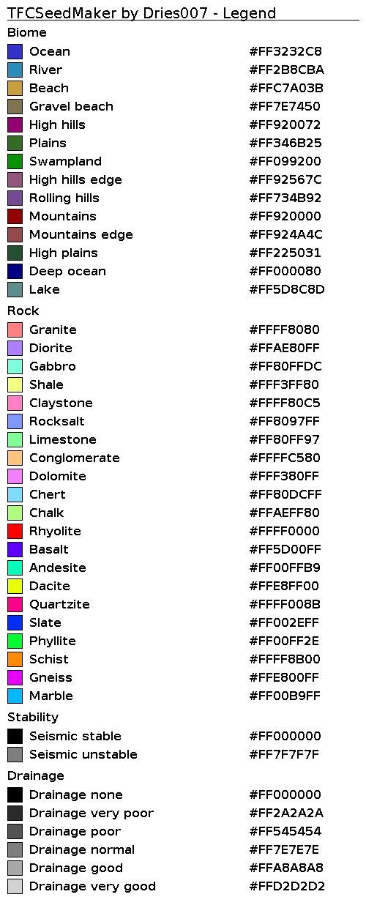

TFC Seed Maker
==============

Purpose
-------

There are 2 main reasons I'm making this:

1. I wanted to be able to check one or more existing seeds for resoureces and/or make maps of those resources.
2. I wanted to make a non-spoiling way to select a good seed. (aka be sure it has some decent resources within a reasonable radius of spawn, without knowing where to go look)

**For info about the maps, including a color legend, see [below](#legend).**

Download builds [here](https://jenkins.dries007.net/job/TFCSeedMaker/).

License
-------

Unless otherwise specified per file, or per package via the package-info.java file:

Copyright &copy; 2015 - Dries007 - Available under [GPLv3](license.md)

This program contains code from the [Terrafirmacraft mod](https://github.com/Deadrik/TFCraft).

Done/Todo
----

- [x] Make maps per layer + combined
- [x] Multithreading
- [x] Biomes
- [x] Rock types
- [x] Trees
- [x] Json output of discovered information
- [x] EVT
- [x] Rain
- [x] Stability
- [x] pH
- [x] Drainage
- [x] Add Gradle file and use it for dependecies
- [ ] Seed rating system
    - [ ] Requirements
    - [ ] Instant rejections
    - [ ] Score system
- [ ] Add "hardcoded" tree generation
- [ ] Crops
- [ ] Animals

Legend
------

The lines on the map are 1000x1000 grid lines.
The resolution is 1 block per pixel.
The "combined" map is a biome map with the outlines of the rock and tree layers.

You can also generate this image by running the `net.dries007.tfc.seedmaker.MainLegend` class.

